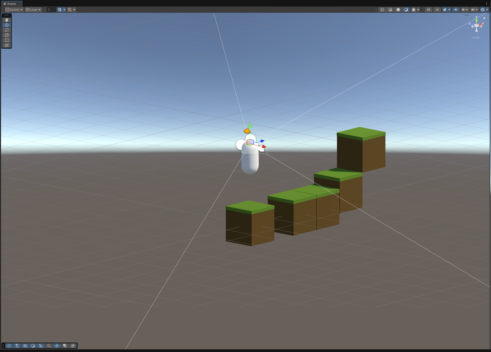

# Entropica

*An indie sci‑fi survival RPG set in a dynamic, ever‑changing forest.*

## Description

More details coming soon.

## Roles

* **3D Artist:** 
* **Script Writer:** Pranto
* **Lead Programmer:** Md Muntasir Khan

## Getting Started

1. **Clone the repo:**

   ```bash
   git clone https://github.com/YourUser/Entropica.git
   ```
2. **Install Unity:** Use Unity 2021.3 LTS or later.
3. **Open & Run:**

   * Launch Unity Hub, add the project folder.
   * Press **Play** in the Editor.
## Screenshots

*More content (story, controls, features) will be added shortly!*
